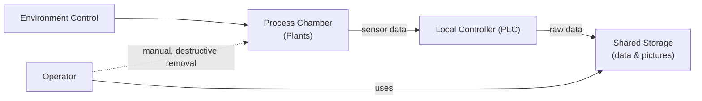
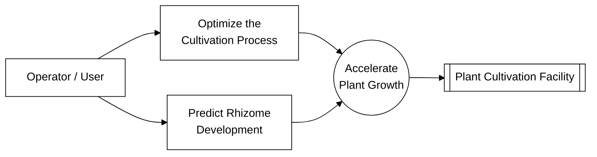
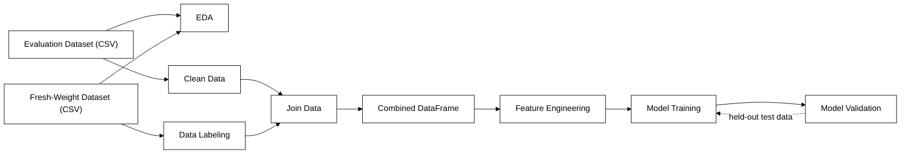
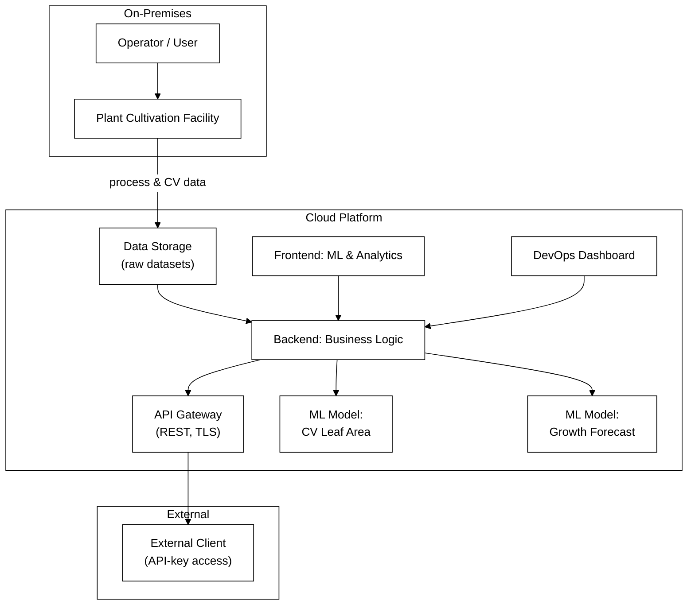
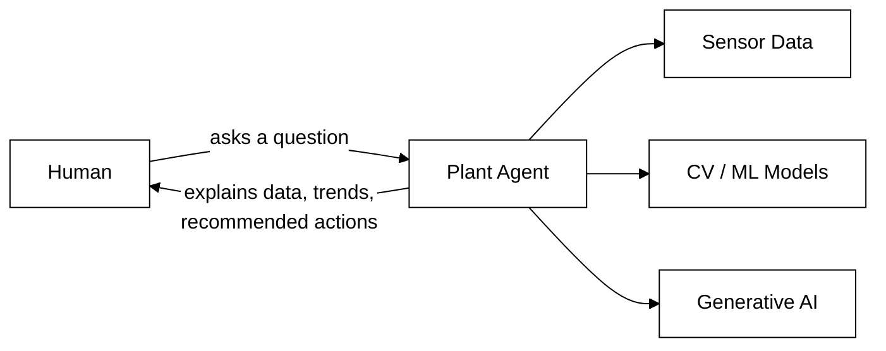

# Predicting Rhizome Development of Rhodiola Plants with AI Based on Above-Ground Parameters

> **Final Project — IHK-Certified Professional Specialist for Artificial Intelligence and Machine Learning** — *15 December 2025*

## 📌 At a Glance

| | |
|---|---|
| **Type** | Certification project (applied ML / data science) |
| **Presenter** | An AI/ML practitioner with a background in software, project, and product development |
| **Organization** | An indoor vertical farming startup |
| **Domain** | Computer Vision, Time-Series Sensor Data, Supervised Machine Learning, AgriTech |
| **Plant** | *Rhodiola* (perennial medicinal plant grown indoors) |
| **Target variable** | Rhizome weight / development class |
| **Best model** | XGBoost (class-weighted) — 88% accuracy |
| **Budget / Timeline** | €15,000 · ~15.6 person-days · 5 calendar weeks |

---

## ❓ What

The project predicts the **rhizome development of *Rhodiola* plants using only above-ground growth parameters** (plant height, shoot count, light intensity, density) — instead of relying on manual, destructive rhizome weighing.

It was carried out as the final project for an IHK ("Chamber of Industry and Commerce") certification in AI and Machine Learning, in cooperation with an indoor vertical-farming startup that grows perennial, high-value plants in modular, climate-independent indoor systems.

The project covers the full applied-ML lifecycle: business analysis → stakeholder & process analysis → exploratory data analysis (EDA) across three data sources → feature engineering → model comparison → explainability → a forward-looking platform architecture.

---

## 🤔 Why

### The business problem
Rhizome weight is the key quality indicator of a *Rhodiola* harvest, but it can currently only be measured **destructively** (the plant has to be removed and cut) and with **high manual effort** during cultivation.

| | |
|---|---|
| **Need for action** | Rhizome weight cannot be measured non-destructively, and only with high manual effort during cultivation |
| **Benefit** | Reduce manual effort in capturing growth parameters; estimate rhizome weight and maximize harvest yield |
| **Goal** | Predict the rhizome development of *Rhodiola* plants from data that is already, or easily, collectible |

### Why this matters to the business
A reliable, non-destructive prediction model would let the company monitor crop quality continuously, intervene earlier, and scale cultivation decisions across many growing units without manually sacrificing plants for measurement.

### Stakeholder interests

| Stakeholder Group | Role / Responsibility | Interest in the Project | Influence |
|---|---|---|---|
| Founders / Management | Strategy, funding, company leadership | Startup success, market share, ROI | High |
| Development team (ML & Software) | Building AI, app, data processing | Technical quality, innovation | Medium |
| Operator / User | Operating the solution in the facility or lab | Reliable results, cost & time savings | High |
| Investors / Funding bodies | Financing, growth | Profitability, degree of innovation | High |
| Cloud & system partners (e.g. Azure) | Providing infrastructure & security | Stable operation, compliance | Medium |
| Research partners / expert network | Validation, pilot projects, knowledge transfer | Technical progress, data quality | Medium |

---

## 🛠️ How

### 1. Understanding the current (AS-IS) process
Today, the cultivation facility runs fully on-premises: sensors feed raw growth data into a local controller, which forwards data and photos to shared storage. To get the ground-truth rhizome weight, an operator still has to **manually remove the plant container** and weigh the rhizome by hand.

### 2. Defining the AI use cases
Two candidate use cases were derived from the AS-IS process, both serving the same higher-level goal of accelerating plant growth:

### 3. Project plan & budget
A tightly scoped, 5-week plan was used to validate feasibility before scaling:

| Phase | Work Package | Planned (days) | Actual (days) |
|---|---|---|---|
| Preparation | Business analysis | 1 | 2 |
| Data analysis | Data review & import | 0.5 | 1 |
| Data analysis | Exploratory Data Analysis (EDA) | 4 | 3 |
| Data preparation | Cleaning & augmentation | 3 | 2 |
| Model build & training | Model architecture & pipeline | 4 | 3 |
| Model build & training | Training | 0.5 | 1 |
| Evaluation & wrap-up | Evaluation & documentation | 2.5 | 2 |
| **Total** | | **15.5** | **14** |

**Budget:** €15,000 · **Dev day rate (net):** €960/day · **Max. time:** 15.6 days

### 4. Evaluating the data per use case
Before building any model, each available data source was checked against both use cases for quality and fit:

| Use Case | Image Data (CV) | Process & Environment Data | Plant Data |
|---|---|---|---|
| Optimize process | ✅ | ✅ | ✅ |
| Predict rhizome development | ❌ | ❌ | ✅ |
| **Insight** | Feature for a downstream ML model | Feature for a downstream ML model | Consistent data basis for the ML model |

**Image data:** quality was inconsistent, computer-vision leaf-area detection was complex and effort-intensive for a PoC, and the output amounted to "just" sensor-like values — useful only as a feature, not as a standalone solution.

**Process & environment data:** process and plant datasets did not cover the same time window, leaving the combined dataset incomplete. Electrical conductivity (EC) acted as a recurring growth-limiting factor.

**Plant data:** showed a clear positive correlation between plant height and shoot count (r = 0.69) and provided the most consistent foundation for modeling — and, once tracked over time, also showed a strong correlation with rhizome development itself, making rhizome-development prediction viable after all.

### 5. Labeling the data
Plants were labeled into three development classes based on final rhizome weight after the trial concluded:

| Label | Condition | Description |
|---|---|---|
| poor | Rhizome weight < 20 g | Below-average development |
| normal | Rhizome weight ≥ 20 g | Average development |
| target | Rhizome weight ≤ 30 g | Target zone for optimal development |

### 6. Building the data pipeline

### 7. Feature engineering
- **Growth rate** = change from the previous measurement point (e.g. plant grows from 100 mm to 120 mm → height rate = +20 mm)
- **Height-per-shoot ratio** = height ÷ shoot count (e.g. 200 mm / 10 shoots = 20 mm per shoot)

Growth rates capture dynamics over time; ratios capture efficiency/balance of growth.

**Feature assessment:** plant height & shoot count were the strongest direct growth indicators; light intensity was a useful supporting feature explaining class differences; density was a weak feature, better suited as a control variable.

### 8. Choosing the model

| Criterion | Linear Regression | Random Forest | XGBoost |
|---|---|---|---|
| Relationship type | Linear only | Non-linear, but averages strongly | Non-linear, captures complex patterns precisely |
| Learning principle | One fixed line | Many independent trees averaged | Boosting — sequential trees correct prior errors |
| Performance (Recall/Precision) | Weak on complex patterns | Medium — good baseline, smooths detail | High — separates classes precisely, better recall & precision |
| Interpretability | High — easy to explain | Medium — feature importance available | Medium — feature importance, but more complex |
| Fit for growth data | Not suitable — no curvature | Good — robust, limited accuracy | Very good — flexible, accurate, robust |

### 9. Results

| Model | Accuracy | Macro F1 | Target-class F1 | Macro Precision | Macro Recall |
|---|---|---|---|---|---|
| Random Forest | 0.85 | 0.79 | 0.67 | 0.82 | 0.78 |
| XGBoost | 0.87 | 0.82 | 0.67 | 0.79 | 0.86 |
| **XGBoost (class-weighted)** | **0.88** | **0.83** | **0.70** | 0.83 | 0.83 |

The final model reaches **88% accuracy** and reliably recognizes a plant's development state in practice. **XGBoost with class weights** balances all classes most fairly and robustly; further fine-tuning of the weights could improve results further.

### 10. Explainability
A single decision tree shows **light intensity** as the most influential variable early in its splits. But aggregated across **all** trees in the model, the feature-importance (gain) view shows **density** has the largest overall influence, closely followed by light intensity — a reminder that single-tree explanations and whole-model explanations can tell different stories.

### 11. Future outlook: scaling to a Plant ML Platform
To move beyond a single-facility PoC, the project outlines a cloud platform with these requirements:

- **Scalability** — parallel processing of multiple facilities and datasets in the cloud
- **Modularity** — clear separation of on-premises, cloud, and external interfaces
- **Lifecycle management** — central control of training, deployment, and monitoring of ML models
- **Security** — protected access via REST API with TLS encryption and API keys
- **Traceability** — a DevOps dashboard for monitoring and controlling all ML processes
- **Integration** — central collection, analysis, and versioning of computer-vision and process data
- **Governance** — EU AI Act, EU Data Act, data protection, access-rights concept

### 12. The next vision: conversational plant agents
> *"I'd love to be able to ask the plants questions!"*
> — a botanist on the project team, during a workshop conversation

The long-term vision is to let humans **talk to the cultivation facility in natural language**, combining sensors, CV/ML models, and generative AI:

**Result:** transparent, explainable, and interactive plant control — operators ask, the agent answers.

---

## ✅ Key Takeaways

| # | Takeaway |
|---|---|
| 1 | **Not all data sources are equally fit for every use case** — image and process data became *features*, while plant data became the *foundation* |
| 2 | **EDA before modeling pays off** — it revealed which use case was actually achievable with the available data |
| 3 | **XGBoost with class weighting** gave the most accurate and fairest predictions (88% accuracy) |
| 4 | **Tree-level and model-level explainability can disagree** — always check feature importance at both levels |
| 5 | **The PoC is a stepping stone** to a scalable, governed, multi-facility ML platform — not the end state |

